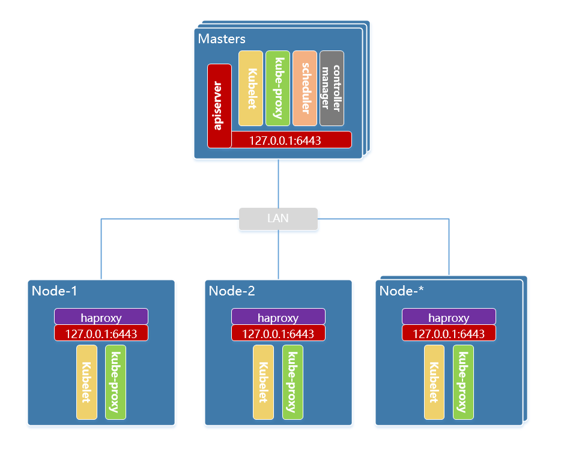

# kainstall  =  kubeadm install kubernetes

[](https://github.com/marketplace/actions/super-linter)

使用 shell 脚本, 基于 kubeadm 一键部署 kubernetes HA 集群

## 为什么

**为什么要搞这个？Ansible PlayBook 不好么？**

**因为懒**，Ansible PlayBook 编排是非常给力的，不过需要安装 Python 和 Ansible, 且需要下载多个 yaml 文件 。**因为懒**，我想要个更简单的方式来**快速部署**一个分布式的 **Kubernetes HA** 集群， 使用 **shell** 脚本可以不借助外力直接在服务器上运行，省时省力。 并且 shell 脚本只有一个文件，文件大小**100 KB 左右**，非常小巧，可以实现一条命令安装集群的超快体验，而且配合**离线安装包**，可以在不联网的环境下安装集群，这体验真的**非常爽**啊。

## 要求

OS: `centos 7.x x64` , `centos 8.x x64`,  `debian 9.x x64` , `debian 10.x x64`, `ubuntu 20.04 x64`, `ubuntu 20.10 x64`, `ubuntu 21.04 x64`

CPU: `2C`

MEM: `4G`

认证: 集群节点需**统一认证**; 使用密码认证时，集群节点需使用同一用户名和密码，使用密钥认证时，集群节点需使用同一个密钥文件登陆。

> 未指定离线包时，需要连通外网，用于下载 kube 组件和 docker 镜像。

## 架构



> 如需按照步骤安装集群，可参考 [https://lework.github.io/2019/10/01/kubeadm-install/](https://lework.github.io/2019/10/01/kubeadm-install/)

## 功能

- 服务器初始化。
  - 关闭 `selinux`
  - 关闭 `swap`
  - 关闭 `firewalld`
  - 配置 `epel` 源
  - 修改 `limits`
  - 配置内核参数
  - 配置 `history` 记录
  - 配置 `journal` 日志
  - 配置 `chrony` 时间同步
  - 添加 `ssh-login-info` 信息
  - 配置 `audit` 审计
  - 安装 `ipvs` 模块
  - 更新内核
- 安装`kube`组件。
- 初始化`kubernetes`集群,以及增加或删除节点。
- 安装`ingress`组件，可选`nginx`，`traefik`。
- 安装`network`组件，可选`flannel`，`calico`，`cilium`。
- 安装`monitor`组件，可选`prometheus`。
- 安装`log`组件，可选`elasticsearch`。
- 安装`storage`组件，可选`rook`，`longhorn`。
- 安装`web ui`组件，可选`dashboard`, `kubesphere`。
- 安装`addon`组件，可选`metrics-server`, `nodelocaldns`。
- 安装`cri`组件，可选`docker`, `containerd`, `cri-o`
- 升级到`kubernetes`指定版本。
- 更新集群证书。
- 添加运维操作，如备份etcd快照。
- 支持**离线部署**。
- 支持**sudo特权**。
- 支持**10年证书期限**。
- 支持脚本更新。

## 默认版本

| 分类                                           | 软件                                             | kainstall 默认版本 | 软件最新版本                                                 |
| ------------------------------------------------ | ------------------ | ------------------------------------------------------------ | ------------------------------------------------ |
| common | [docker-ce](https://github.com/docker/docker-ce) | latest             |  |
| common | [kubernetes](https://github.com/kubernetes/kubernetes) | latest             |  |
| network | [flannel](https://github.com/coreos/flannel) | 0.15.1            |  |
| network | [calico](https://github.com/projectcalico/calico) | 3.21.2 |  |
| network | [cilium](https://github.com/cilium/cilium) | 1.9.11 |  |
| addons | [metrics server](https://github.com/kubernetes-sigs/metrics-server) | 0.5.2             |  |
| addons | [nodelocaldns](https://github.com/kubernetes/dns/tree/master/cmd/node-cache) | latest           | 1.21.1 |
| ingress | [ingress nginx controller](https://github.com/kubernetes/ingress-nginx) | 1.1.0          |  |
| ingress | [traefik](https://github.com/traefik/traefik) | 2.5.6         |  |
| monitor | [kube_prometheus](https://github.com/prometheus-operator/kube-prometheus) | 0.9.0             |  |
| log | [elasticsearch](https://github.com/elastic/elasticsearch) | 7.16.2         |  |
| storage | [rook](https://github.com/rook/rook) | 1.8.1 |  |
| storage | [longhorn](https://github.com/longhorn/longhorn) | 1.2.3 |  |
| ui | [kubernetes_dashboard](https://github.com/kubernetes/dashboard) | 2.4.0            |  |
| ui | [kubesphere](https://github.com/kubesphere/kubesphere) | 3.2.1            |  |

除 **kube组件** 版本可以通过参数(`--version`) 指定外，其他的软件版本需在脚本中指定。

## 使用

> 案例使用请见：[https://lework.github.io/2020/09/26/kainstall](https://lework.github.io/2020/09/26/kainstall)

### 下载脚本

```bash
# centos
wget https://cdn.jsdelivr.net/gh/lework/kainstall@master/kainstall-centos.sh

# debian
wget https://cdn.jsdelivr.net/gh/lework/kainstall@master/kainstall-debian.sh

# ubuntu
wget https://cdn.jsdelivr.net/gh/lework/kainstall@master/kainstall-ubuntu.sh
```

### 帮助信息

```bash
# bash kainstall-centos.sh


Install kubernetes cluster using kubeadm.

Usage:
  kainstall-centos.sh [command]

Available Commands:
  init            Init Kubernetes cluster.
  reset           Reset Kubernetes cluster.
  add             Add nodes to the cluster.
  del             Remove node from the cluster.
  renew-cert      Renew all available certificates.
  upgrade         Upgrading kubeadm clusters.
  update          Update script file.

Flag:
  -m,--master          master node, default: ''
  -w,--worker          work node, default: ''
  -u,--user            ssh user, default: root
  -p,--password        ssh password
     --private-key     ssh private key
  -P,--port            ssh port, default: 22
  -v,--version         kube version, default: latest
  -n,--network         cluster network, choose: [flannel,calico,cilium], default: flannel
  -i,--ingress         ingress controller, choose: [nginx,traefik], default: nginx
  -ui,--ui             cluster web ui, choose: [dashboard,kubesphere], default: dashboard
  -a,--addon           cluster add-ons, choose: [metrics-server,nodelocaldns], default: metrics-server
  -M,--monitor         cluster monitor, choose: [prometheus]
  -l,--log             cluster log, choose: [elasticsearch]
  -s,--storage         cluster storage, choose: [rook,longhorn]
     --cri             cri runtime, choose: [docker,containerd,cri-o], default: docker
     --cri-version     cri version, default: latest
     --cri-endpoint    cri endpoint, default: /var/run/dockershim.sock
  -U,--upgrade-kernel  upgrade kernel
  -of,--offline-file   specify the offline package file to load
      --10years        the certificate period is 10 years.
      --sudo           sudo mode
      --sudo-user      sudo user
      --sudo-password  sudo user password

Example:
  [init cluster]
  kainstall-centos.sh init \
  --master 192.168.77.130,192.168.77.131,192.168.77.132 \
  --worker 192.168.77.133,192.168.77.134,192.168.77.135 \
  --user root \
  --password 123456 \
  --version 1.20.6

  [reset cluster]
  kainstall-centos.sh reset \
  --user root \
  --password 123456

  [add node]
  kainstall-centos.sh add \
  --master 192.168.77.140,192.168.77.141 \
  --worker 192.168.77.143,192.168.77.144 \
  --user root \
  --password 123456 \
  --version 1.20.6

  [del node]
  kainstall-centos.sh del \
  --master 192.168.77.140,192.168.77.141 \
  --worker 192.168.77.143,192.168.77.144 \
  --user root \
  --password 123456
 
  [other]
  kainstall-centos.sh renew-cert --user root --password 123456
  kainstall-centos.sh upgrade --version 1.20.6 --user root --password 123456
  kainstall-centos.sh update
  kainstall-centos.sh add --ingress traefik
  kainstall-centos.sh add --monitor prometheus
  kainstall-centos.sh add --log elasticsearch
  kainstall-centos.sh add --storage rook
  kainstall-centos.sh add --ui dashboard
  kainstall-centos.sh add --addon nodelocaldns
```

### 初始化集群

```bash
# 使用脚本参数
bash kainstall-centos.sh init \
  --master 192.168.77.130,192.168.77.131,192.168.77.132 \
  --worker 192.168.77.133,192.168.77.134 \
  --user root \
  --password 123456 \
  --port 22 \
  --version 1.20.6

# 使用环境变量
export MASTER_NODES="192.168.77.130,192.168.77.131,192.168.77.132"
export WORKER_NODES="192.168.77.133,192.168.77.134"
export SSH_USER="root"
export SSH_PASSWORD="123456"
export SSH_PORT="22"
export KUBE_VERSION="1.20.6"
bash kainstall-centos.sh init
```

> 默认情况下，除了初始化集群外，还会安装 `ingress: nginx` , `ui: dashboard` 两个组件。

还可以使用一键安装方式, 连下载都省略了。

```bash
bash -c "$(curl -sSL https://cdn.jsdelivr.net/gh/lework/kainstall@master/kainstall-centos.sh)"  \
  - init \
  --master 192.168.77.130,192.168.77.131,192.168.77.132 \
  --worker 192.168.77.133,192.168.77.134 \
  --user root \
  --password 123456 \
  --port 22 \
  --version 1.20.6
```

### 增加节点

> 操作需在 k8s master 节点上操作，ssh连接信息非默认时请指定

```bash
# 增加单个master节点
bash kainstall-centos.sh add --master 192.168.77.135

# 增加单个worker节点
bash kainstall-centos.sh add --worker 192.168.77.134

# 同时增加
bash kainstall-centos.sh add --master 192.168.77.135,192.168.77.136 --worker 192.168.77.137,192.168.77.138
```

### 删除节点

> 操作需在 k8s master 节点上操作，ssh连接信息非默认时请指定

```bash
# 删除单个master节点
bash kainstall-centos.sh del --master 192.168.77.135

# 删除单个worker节点
bash kainstall-centos.sh del --worker 192.168.77.134

# 同时删除
bash kainstall-centos.sh del --master 192.168.77.135,192.168.77.136 --worker 192.168.77.137,192.168.77.138
```

### 重置集群

```bash
bash kainstall-centos.sh reset \
  --user root \
  --password 123456 \
  --port 22 \
```

### 其他操作

> 操作需在 k8s master 节点上操作，ssh连接信息非默认时请指定
> **注意：** 添加组件时请保持节点的内存和cpu至少为`2C4G`的空闲。否则会导致节点下线且服务器卡死。

```bash
# 添加 nginx ingress
bash kainstall-centos.sh add --ingress nginx

# 添加 prometheus
bash kainstall-centos.sh add --monitor prometheus

# 添加 elasticsearch
bash kainstall-centos.sh add --log elasticsearch

# 添加 rook
bash kainstall-centos.sh add --storage rook

# 添加 nodelocaldns
bash kainstall-centos.sh add --addon nodelocaldns

# 升级版本
bash kainstall-centos.sh upgrade --version 1.20.6

# 重新颁发证书
bash kainstall-centos.sh renew-cert

# debug模式
DEBUG=1 bash kainstall-centos.sh

# 更新脚本
bash kainstall-centos.sh update

# 使用 cri-o containerd runtime
bash kainstall-centos.sh init \
  --master 192.168.77.130,192.168.77.131,192.168.77.132 \
  --worker 192.168.77.133,192.168.77.134,192.168.77.135 \
  --user root \
  --password 123456 \
  --cri containerd
  
# 使用 cri-o cri runtime
bash kainstall-centos.sh init \
  --master 192.168.77.130,192.168.77.131,192.168.77.132 \
  --worker 192.168.77.133,192.168.77.134,192.168.77.135 \
  --user root \
  --password 123456 \
  --cri cri-o
```

### 默认设置

> **注意:** 以下变量都在脚本文件的`environment configuration`部分。可根据需要自行修改，或者为变量设置同名的**环境变量**修改其默认内容。

```bash
# 版本
KUBE_VERSION="${KUBE_VERSION:-latest}"
FLANNEL_VERSION="${FLANNEL_VERSION:-0.15.1}"
METRICS_SERVER_VERSION="${METRICS_SERVER_VERSION:-0.5.2}"
INGRESS_NGINX="${INGRESS_NGINX:-1.1.0}"
TRAEFIK_VERSION="${TRAEFIK_VERSION:-2.5.6}"
CALICO_VERSION="${CALICO_VERSION:-3.21.2}"
CILIUM_VERSION="${CILIUM_VERSION:-1.9.11}"
KUBE_PROMETHEUS_VERSION="${KUBE_PROMETHEUS_VERSION:-0.9.0}"
ELASTICSEARCH_VERSION="${ELASTICSEARCH_VERSION:-7.16.2}"
ROOK_VERSION="${ROOK_VERSION:-1.8.1}"
LONGHORN_VERSION="${LONGHORN_VERSION:-1.2.3}"
KUBERNETES_DASHBOARD_VERSION="${KUBERNETES_DASHBOARD_VERSION:-2.4.0}"
KUBESPHERE_VERSION="${KUBESPHERE_VERSION:-3.2.1}"

# 集群配置
KUBE_DNSDOMAIN="${KUBE_DNSDOMAIN:-cluster.local}"
KUBE_APISERVER="${KUBE_APISERVER:-apiserver.$KUBE_DNSDOMAIN}"
KUBE_POD_SUBNET="${KUBE_POD_SUBNET:-10.244.0.0/16}"
KUBE_SERVICE_SUBNET="${KUBE_SERVICE_SUBNET:-10.96.0.0/16}"
KUBE_IMAGE_REPO="${KUBE_IMAGE_REPO:-registry.cn-hangzhou.aliyuncs.com/kainstall}"
KUBE_NETWORK="${KUBE_NETWORK:-flannel}"
KUBE_INGRESS="${KUBE_INGRESS:-nginx}"
KUBE_MONITOR="${KUBE_MONITOR:-prometheus}"
KUBE_STORAGE="${KUBE_STORAGE:-rook}"
KUBE_LOG="${KUBE_LOG:-elasticsearch}"
KUBE_UI="${KUBE_UI:-dashboard}"
KUBE_ADDON="${KUBE_ADDON:-metrics-server}"
KUBE_FLANNEL_TYPE="${KUBE_FLANNEL_TYPE:-vxlan}"
KUBE_CRI="${KUBE_CRI:-docker}"
KUBE_CRI_VERSION="${KUBE_CRI_VERSION:-latest}"
KUBE_CRI_ENDPOINT="${KUBE_CRI_ENDPOINT:-/var/run/dockershim.sock}"

# 定义的master和worker节点地址，以逗号分隔
MASTER_NODES="${MASTER_NODES:-}"
WORKER_NODES="${WORKER_NODES:-}"

# 定义在哪个节点上进行设置
MGMT_NODE="${MGMT_NODE:-127.0.0.1}"

# 节点的连接信息
SSH_USER="${SSH_USER:-root}"
SSH_PASSWORD="${SSH_PASSWORD:-}"
SSH_PRIVATE_KEY="${SSH_PRIVATE_KEY:-}"
SSH_PORT="${SSH_PORT:-22}"
SUDO_USER="${SUDO_USER:-root}"

# 节点设置
HOSTNAME_PREFIX="${HOSTNAME_PREFIX:-k8s}"

# 脚本设置
GITHUB_PROXY="${GITHUB_PROXY:-https://gh.lework.workers.dev/}"
GCR_PROXY="${GCR_PROXY:-k8sgcr.lework.workers.dev}"
SKIP_UPGRADE_PLAN=${SKIP_UPGRADE_PLAN:-false}
SKIP_SET_OS_REPO=${SKIP_SET_OS_REPO:-false}
```

### 离线部署

> **注意**, 脚本执行的宿主机上，需要安装 `tar` 命令，用于解压离线包。
> 详细部署请见: [https://lework.github.io/2020/10/18/kainstall-offline/](https://lework.github.io/2020/10/18/kainstall-offline/)

1. 下载指定版本的离线包

    ```bash
    wget https://github.com/lework/kainstall-offline/releases/download/1.20.6/1.20.6_centos7.tgz
    ```

    > 更多离线包信息，见 [kainstall-offline](https://github.com/lework/kainstall-offline) 仓库

2. 初始化集群

    > 指定 `--offline-file` 参数。

    ```bash
    bash kainstall-centos.sh init \
      --master 192.168.77.130,192.168.77.131,192.168.77.132 \
      --worker 192.168.77.133,192.168.77.134 \
      --user root \
      --password 123456 \
      --version 1.20.6 \
      --upgrade-kernel \
      --10years \
      --offline-file 1.20.6_centos7.tgz
    ```

3. 添加节点

    > 指定 --offline-file 参数。

    ```bash
    bash kainstall-centos.sh add \
      --master 192.168.77.135 \
      --worker 192.168.77.136 \
      --user root \
      --password 123456 \
      --version 1.20.6 \
      --offline-file 1.20.6_centos7.tgz
    ```

### sudo 特权

创建 sudo 用户

```bash
useradd test
passwd test --stdin <<< "12345678"
echo 'test    ALL=(ALL)   NOPASSWD:ALL' >> /etc/sudoers
```

sudo 参数

- `--sudo` 开启 sudo 特权
- `--sudo-user` 指定 sudo 用户, 默认是 `root`
- `--sudo-password` 指定 sudo 密码

示例

```bash
# 初始化
bash kainstall-centos.sh init \
  --master 192.168.77.130,192.168.77.131,192.168.77.132 \
  --worker 192.168.77.133,192.168.77.134 \
  --user test \
  --password 12345678 \
  --port 22 \
  --version 1.20.6 \
  --sudo \
  --sudo-user root \
  --sudo-password 12345678

# 添加
bash kainstall-centos.sh add \
  --master 192.168.77.135 \
  --worker 192.168.77.136 \
  --user test \
  --password 12345678 \
  --port 22 \
  --version 1.20.6 \
  --sudo \
  --sudo-user root \
  --sudo-password 12345678

# 更新脚本文件
bash kainstall-centos.sh update
```

### 10年证书期限

**注意:** 此操作需要联网下载。

使用 [kubeadm-certs](https://github.com/lework/kubeadm-certs) 项目编译的 `kubeadm` 客户端， 其修改了 `kubeadm` 源码，将 1 年期限修改成 10 年期限，具体信息见仓库介绍。

在初始化或添加时，加上 `--10years` 参数，就可以使用`kubeadm` 10 years 的客户端

示例

```bash
# 初始化
bash kainstall-centos.sh init \
  --master 192.168.77.130,192.168.77.131,192.168.77.132 \
  --worker 192.168.77.133,192.168.77.134 \
  --user root \
  --password 123456 \
  --port 22 \
  --version 1.20.6 \
  --10years
  
# 添加
bash kainstall-centos.sh add \
  --master 192.168.77.135 \
  --worker 192.168.77.136 \
  --user root \
  --password 123456 \
  --port 22 \
  --version 1.20.6 \
  --10years
```

## 联系方式

- [QQ群](https://qm.qq.com/cgi-bin/qm/qr?k=HwpkLUcmroLKNv37TlrHY-D3SXuLKMOd&jump_from=webapi)
- [论坛](https://leops.cn/topics/node51)

## License

MIT
